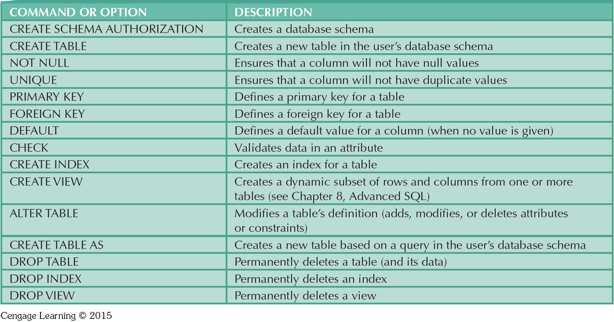

# Ch2. Data Models

* Entity: Unique and distinct object used to collect and store data
* Attribute: Characteristic of an entity
* Relationship: Describes an association among entities
  * One-to-many \(1:M\)
  * Many-to-many \(M:N or M:M\)
  * One-to-one \(1:1\)
* Constraint: Set of rules to ensure data integrity

### Standard Database Concepts

* Schema 
  * Conceptual organization of the entire database as viewed by the database administrator 
* Subschema 
  * Portion of the database seen by the application programs that produce the desired information from the data within the database
* Data manipulation language \(DML\) 
  * Environment in which data can be managed and is used to work with the data in the database Schema 
* data definition language \(DDL\) 
  * Enables the database administrator to define the schema components

### The Relational Model

Produced an automatic transmission database that replaced standard transmission databases 

* Based on a relation Relation or table: 
  * Matrix composed of intersecting tuple and attribute 
    * Tuple: Rows 
    * Attribute: Columns 
* Describes a precise set of data manipulation constructs

Advantages:

* Structural independence is promoted using independent tables 
* Tabular view improves conceptual simplicity 
* Ad hoc query capability is based on SQL 
* Isolates the end user from physical-level details 
* Improves implementation and management simplicity

Relational Database Management System\(RDBMS\)

* Performs basic functions provided by the hierarchical and network 
* DBMS systems Makes the relational data model easier to understand and implement 
* Hides the complexities of the relational model from the user

### The Entity Relationship Model

* Graphical representation of entities and their relationships in a database structure 
* Entity relationship diagram \(ERD\) 
  * Uses graphic representations to model database components 
* Entity instance or entity occurrence 
  * Rows in the relational table 
* Connectivity: Term used to label the relationship types

pros:

* Visual modeling yields conceptual simplicity 
* Visual representation makes it an effective communication tool 
* Is integrated with the dominant relational model

cons:

* Limited constraint representation 
* Limited relationship representation 
* No data manipulation language 
* Loss of information content occurs when attributes are removed from entities to avoid crowded displays

#### The ER Model Notations

## O-O databases

Also called 'object stores', these dbs offer\(ed\) a way to store \("persist"\) objects on disk. The objects \(entity instances\) are instanced from classes \(entities\), like with standard OO programming practice.

Advantages:

* 'cleaner' design - objects mimic real-world counterparts
* inheritance and encapsulation possible
* richer datatypes \(attributes\) available
* good for CAD, multimedia..

Drawbacks:

* harder to query \(compared to relational DBs\) - no straightforward way to build and traverse relations between objects
* relations are simpler in certain situations

The RDBMS community collectively ignored this development.

## O-R databases

These are a compromise between RDBs and OODBs - they feature an O-O front-end over a relational architecture. Interfacing applications do so in an O-O way, and queries/modifications are translated to/from relational form \("ORM"\).

Benefits:

* easy to access the data from an O-O application
* queries can be simpler \(can use objects' structure\)

Drawback:

* performance can be poor on account of the two-way translation

